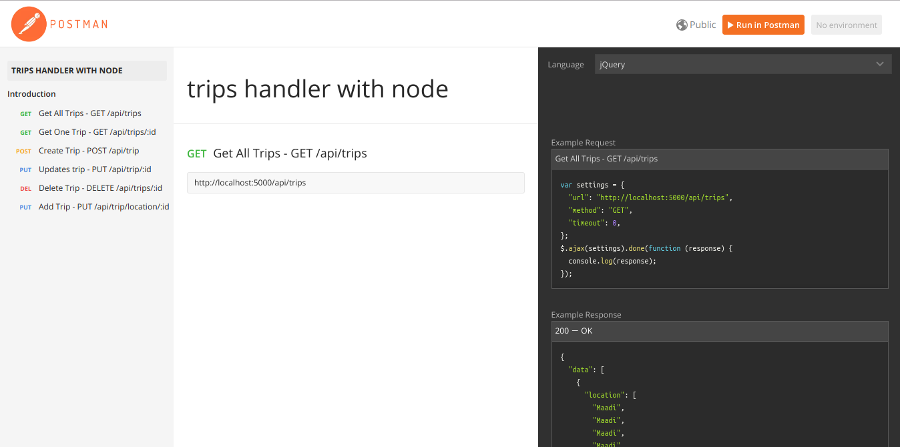

# Trips Handler

The purpose of this project is to make a simple CRUD operations on the trips table as well as inserting trips locations.

## Tools and technologies

* Used ``` node.js ``` alongside  ``` mongodb```.

## Installation Steps

* Clone this repo to your local machine.
* Install node and npm check this link for more details : 
<a> https://linuxize.com/post/how-to-install-node-js-on-ubuntu-18.04/</a>
* install mongo, check this link for more details :
<a>https://docs.mongodb.com/manual/installation/ </a>
* Navigate to the folder from your terminal
* Type ``` npm install ``` for installing all the project packages.
* Run the Project by typing ``` npm start ```.

## Folder Structure

### Base folder structure

```
./
├── components
├── config
├── middlewares
├── shared
├── startup
├── app.js

```
* The project structure is based on components based microservices architecture, so the ``` components ``` Folder should contain all the future components, in this project we only started with the <b>trips</b> component.


* ``` config ``` holds the application configurations for different environments such as development, production and testing.

*  ``` middlewares ``` has middlewares of different kinds and behaviors, for now it only has an errorHandler, Logger and validation.

* ``` shared``` contains all the shared services for the whole system, for now it has the errors that could be used by the errorHandler.

* ``` startup ``` holds the main functions that the ``` app.js ``` calls once the server is up like the database connection, routes for the different end-points as well as middlewares.

* ``` app.js ``` Is the main file for the project, it's responsible for getting the startup services up and running.

## Running tests

For running tests this project uses jest, which is a testing framework, you can run the test cases by running ``` npm test ```,
jest usually runs on the testing environment so it uses the testing database.

## Database Schema

As shown in ``` components/trips/v1/TripsSchema.js ```, the Database Schema is as follows: 

```
{
  from: {
    type: String,
  },
  to: {
    type: String,
  },
  status: {
    type: String,
  },
  location: [
    {
      type: String,
    }
  ],
},

```

## POSTMAN Documentation

You can find in this <a>https://documenter.getpostman.com/view/4628217/RzteTD18</a> a POSTMAN documentation for the provided end-points, each end-point comes with an example or more to what should this end-point return.

As you can see in the screenshot below you can find the end-points on the left, description in the middle and examples in the left.



## Finished items

* CRUD operations on the Trips with handeling the most failure scenarios using response codes as well as following rails conventions.

* Insertion of trips locations - For this part in rails it should have been implemented using Background jobs however node's default behaviour is to run every database query asynchronously. -

* Created PostMan API Happy Scenareo testing with Examples

* Created Integration tests on the trip component - Only 2 tests for the create and read trip data -